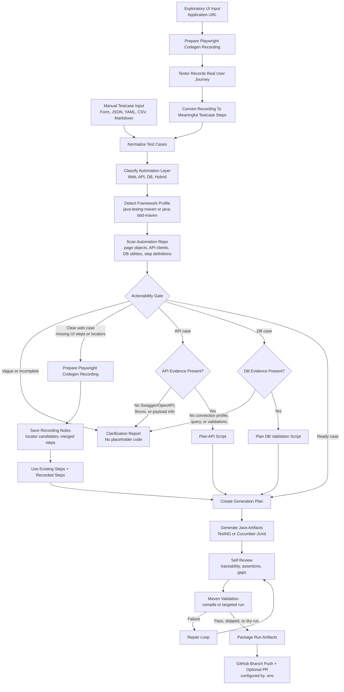

# Test Script Generator

Python/LangGraph starter for generating Java automation scripts from manually supplied test cases or tester-led exploratory recordings.

Current implementation focuses on the safe v1 foundation:

- manual testcase input from JSON/YAML/CSV/Markdown
- exploratory UI mode where a tester provides an application URL, records a Playwright journey, and converts it into testcase steps plus scripts
- `java-testng-maven` and `java-bdd-maven` framework profiles
- BDD generation emits a feature file, Cucumber step-definition class, and JUnit runner
- actionability gate for vague or underspecified tests
- Playwright codegen recording requests for clear web cases with missing UI steps
- API evidence checks for Swagger/OpenAPI, Bruno, or explicit endpoint/payload details
- DB evidence checks for connection profile, query, query parameters, and validation points
- run reports under `.tsg-runs/`
- optional GitHub branch push and PR creation against the repo configured in `.env`

## Flow



## Deep Agent Workflow

```mermaid
flowchart LR
    A[LangGraph Orchestrator<br/>GeneratorState checkpoint] --> B[Manual Input Adapter]
    X[Exploratory URL Adapter<br/>Playwright recording task] --> Y[Recording To Testcase Agent<br/>actions, assertions, titles]
    Y --> B
    B --> C[Framework Profiler Agent<br/>Maven, TestNG, Cucumber-JUnit, repo conventions]
    C --> D[Automation Layer Classifier<br/>Web, API, DB, Hybrid]
    D --> E[Test Case Actionability Agent]

    E -->|Blocked| F[Clarification Pack<br/>missing flow, data, assertions]

    E -->|Web needs evidence| G[Playwright Codegen Recorder<br/>human-assisted recording]
    G --> H[Recording Evidence Store<br/>recorded Java, notes, locator candidates]
    H --> I[Step Merge Agent<br/>original steps + recorded steps]

    E -->|API layer| J[API Evidence Agent<br/>Swagger/OpenAPI, Bruno, payloads]
    E -->|DB layer| K[DB Evidence Agent<br/>connection profile, query, validation points]

    I --> L[Script Planner Agent]
    J --> L
    K --> L
    E -->|Ready| L

    L --> M[Java Writer Agent<br/>TestNG or Cucumber-JUnit]
    M --> N[Assertion and Traceability Reviewer]
    N --> O[Maven Validator]
    O -->|Compile or binding failure| P[Repair Agent]
    P --> M
    O -->|Pass, skipped, or dry run| Q[Report Packager]
    Q --> R[GitHub Branch Publisher<br/>optional PR]
```



## Setup

```powershell
uv sync
```

Install the Playwright browser used by the Explore recorder:

```powershell
npx playwright install chromium
```

Update `.env` with your local settings. Mesh API variables are named:

```env
MESH_API_KEY=
MESH_API_URL=
MESH_MODEL=
```

GitHub PR settings are:

```env
DRY_RUN=false
ALLOW_REPO_WRITES=true
ALLOW_PR_CREATION=true
GIT_PROVIDER=github
GITHUB_OWNER=your-github-org-or-user
GITHUB_REPOSITORY=your-repo
GITHUB_TOKEN=
GITHUB_API_URL=https://api.github.com
GIT_BASE_BRANCH=main
GIT_WORK_BRANCH_PREFIX=ai/generated-tests
```

Generated Java artifacts are written to the GitHub repository configured by
`GITHUB_OWNER` and `GITHUB_REPOSITORY`. The workflow creates a new branch using
`GIT_WORK_BRANCH_PREFIX`, pushes that branch, and creates a pull request when
`ALLOW_PR_CREATION=true`. Keep `DRY_RUN=true` when you only want local run
artifacts and no repository push.

If the configured repository is empty and has no commits yet, the workflow
initializes `GIT_BASE_BRANCH` with the first generated artifact commit. A pull
request is not created for that first push because there is no existing base
branch to target.

## Run

```powershell
uv run test-script-generator generate --input-file input/test-cases.json --framework java-bdd-maven
```

## Run The UI

Start the API:

```powershell
uv run test-script-generator-api
```

Start the React app:

```powershell
cd apps/web
npm run dev
```

Open:

```text
http://127.0.0.1:5173
```

The UI calls the API at `http://127.0.0.1:8001` by default. Override it with `VITE_API_BASE_URL` if needed.

The UI supports three input modes:

- **Form**: manual fields for testcase, Web/API/DB evidence, and steps.
- **JSON**: paste JSON directly or upload a `.json` file.
- **Explore**: provide only an application URL, record the exploratory flow with Playwright codegen, and generate testcase steps plus scripts from that recording.

Explore mode reuses the same generation path as normal testcases:

1. The API creates a Playwright codegen command and a target `playwright-codegen.java` file under the run folder.
2. The tester clicks **Start recorder** and performs the user journey in the browser.
3. After the recorder is closed, the UI calls the exploratory generation endpoint.
4. The backend converts recorded actions into a `SourceTestCase`, then runs the existing actionability, planning, Java writer, validation, report, GitHub push, and PR workflow.
5. The UI shows the inferred testcase steps, logs, generated artifacts, and repository publish result.

JSON mode accepts either a raw testcase object:

```json
{
  "source_id": "TC_API_001",
  "title": "Create order API rejects invalid coupon",
  "automation_layers": ["api"],
  "api": {
    "endpoint": "/api/orders",
    "method": "POST",
    "request_payload": {
      "couponCode": "INVALID"
    },
    "expected_status": 400,
    "expected_response_points": ["error.code == INVALID_COUPON"]
  },
  "steps": [
    {
      "step_number": 1,
      "action": "Submit create order API request with invalid coupon.",
      "expected_result": "API returns invalid coupon error."
    }
  ]
}
```

Or the API request wrapper:

```json
{
  "framework_profile": "java-bdd-maven",
  "test_case": {
    "source_id": "TC_API_001",
    "title": "Create order API rejects invalid coupon",
    "automation_layers": ["api"],
    "api": {
      "endpoint": "/api/orders",
      "method": "POST",
      "request_payload": {
        "couponCode": "INVALID"
      },
      "expected_status": 400,
      "expected_response_points": ["error.code == INVALID_COUPON"]
    },
    "steps": [
      {
        "step_number": 1,
        "action": "Submit create order API request with invalid coupon.",
        "expected_result": "API returns invalid coupon error."
      }
    ]
  }
}
```

The command writes a run folder with:

- `final-report.md`
- `actionability-assessments.json`
- `generation-plan.json`
- `web-recordings.json`
- `api-evidence.json`
- `db-evidence.json`
- `generated-artifacts.json`
- `publish-result.json`

## Behavior

Vague cases such as `place trade -> trade should be placed successfully` are blocked with clarification questions. The generator does not invent locators, hidden workflow steps, payload fields, DB queries, or assertions.

Clear web cases with missing UI implementation details can be routed to Playwright codegen. The generated recording command and notes are saved in the run folder; recorded output is treated as evidence and must be refactored into the Java automation framework.

API cases are blocked unless Swagger/OpenAPI, Bruno, or explicit endpoint/payload/response evidence exists.

DB cases are blocked unless connection profile or credentials, query or named query, and validation points exist. Raw secrets should stay outside testcase files.

## Validate

```powershell
uv run pytest
uv run ruff check .
```
